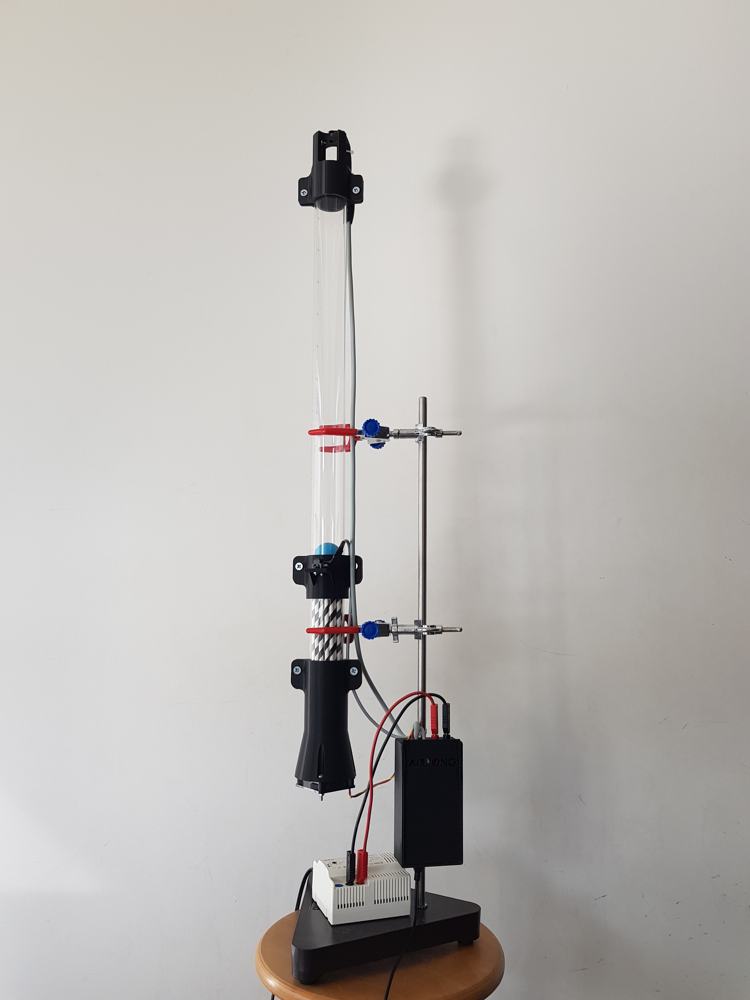
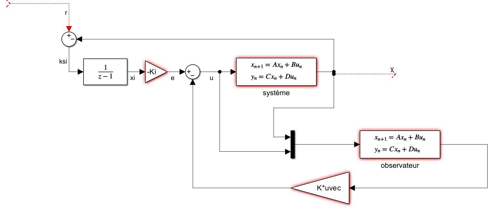
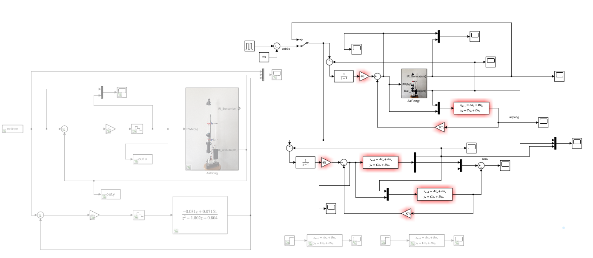
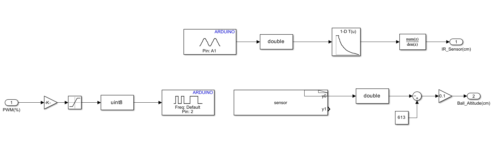

# AirPong: Discrete-Time State-Feedback Control, Observer Design & Event-Triggered Optimization

  
   
  <em>Figure 1: Photo of the Airpong System.</em>

## Description
This repository provides a comprehensive framework for the design, simulation, and Hardware-in-the-Loop (HIL) implementation of a digital control strategy for a pneumatic levitation system named **AirPong**. 

The project demonstrates a complete engineering lifecycle: identifying a physical plant, designing a **Full State Feedback Controller with Integral Action** (for robust disturbance rejection), and coupling it with a **Full-Order Luenberger Observer** to estimate unmeasured states. Additionally, it implements **Event-Triggered Control** to drastically optimize microcontroller CPU overhead.

---

## Project Scope & Objectives
1. **System Identification:** Extracting the discrete transfer function using experimental input-output data via the MATLAB System Identification Toolbox.
2. **State-Space Transformation:** Applying a change of variables to align mathematical states with physical sensor measurements (ball position).
3. **Controller & Observer Synthesis:** Designing optimal state-feedback laws (LQR) and estimators (Luenberger) to ensure tracking performance and stability.
4. **Embedded HIL Control:** Deploying real-time closed-loop control using an Arduino board interfacer, modulating fan PWM based on Infrared sensor feedback.

---

## 🔬 Mathematical & Control Theory Background

The entire theoretical formulation and system matrices derivation are detailed in our project report:  
**[Download the Full Technical Report (PDF)](./docs/Airpong_System_Report.pdf)**

### 1. System Identification & State-Space Model
By stripping transient initialization delays from experimental data, the plant dynamics were characterized into a 2nd-order discrete transfer function:
$$G(z) = \frac{-0.031z + 0.07151}{z^2 - 1.802z + 0.804}$$

To ensure that the first state directly represents the physical position measured by the sensor, a similarity transformation matrix $T = \begin{bmatrix} C \\ 0 \quad 1 \end{bmatrix}$ was applied to obtain $C = \begin{bmatrix} 1 & 0 \end{bmatrix}$:
$$\begin{cases} A_{new} = TAT^{-1} \\ B_{new} = TB \\ C_{new} = CT^{-1} \\ D_{new} = D \end{cases}$$

### 2. Augmented System with Integral Action
To guarantee **zero steady-state error** under step references ($r$), the system state vector was augmented with a discrete integrator state $X_i(k+1) = X_i(k) + r(k) - Y(k)$:
$$\begin{bmatrix} X(k+1) \\ X_i(k+1) \end{bmatrix} = \begin{bmatrix} A & 0 \\ -C & 1 \end{bmatrix} \begin{bmatrix} X(k) \\ X_i(k) \end{bmatrix} + \begin{bmatrix} B \\ 0 \end{bmatrix} u(k) + \begin{bmatrix} 0 \\ 1 \end{bmatrix} r(k)$$

### 3. Full-Order Luenberger Observer
To reconstruct unmeasured states from noisy environments, a state estimator with gain matrix $L$ is integrated:
$$\hat{X}(k+1) = (A - BK - LC)\hat{X}(k) + LCY(k) + Be(k)$$

The complete closed-loop state-space system combining the **Plant**, **Observer**, and **Integrator** yields:
$$\begin{bmatrix} X(k+1) \\ \hat{X}(k+1) \\ X_i(k+1) \end{bmatrix} = \begin{bmatrix} A & -BK & -BK_i \\ LC & A-BK-LC & -BK_i \\ -C & 0 & 1 \end{bmatrix} \begin{bmatrix} X(k) \\ \hat{X}(k) \\ X_i(k) \end{bmatrix} + \begin{bmatrix} 0 \\ 0 \\ 1 \end{bmatrix} r(k)$$

### 4. Optimal Control (Discrete LQR)
The controller gain matrix $\tilde{K} = \begin{bmatrix} K & K_i \end{bmatrix}$ was optimized using a discrete Linear Quadratic Regulator (LQR). The weighting matrix $Q$ was tuned based on the maximum allowable state errors:
$$Q = \begin{bmatrix} \frac{1}{0.5^2} & 0 & 0 \\ 0 & \frac{1}{10^2} & 0 \\ 0 & 0 & 2 \end{bmatrix}$$

  
   
  <em>Figure 2: Theorical closed-loop architecture featuring state-feedback, Luenberger observer, and reference model comparison.</em>

## 🛠️ Simulink Model & Architecture

The physical system is modeled and evaluated directly in Simulink (`sim/Airpong.slx`).

### Full Control Loop Overview
The block diagram couples the physical Arduino-interfaced plant (`airpong`) with a real-time theoretical simulator (`simu`) running in parallel to benchmark expected vs. real transient behaviors.

  
   
  <em>Figure 3: Closed-loop architecture featuring state-feedback, Luenberger observer, and reference model comparison.</em>

### Low-Level Driver (Inside the AirPong Brick)
The hardware subsystem encapsulates low-level drivers communicating with the physical bench:
* **Sensor Acquisition (Pin A1):** Captures raw analog voltage from the Infrared sensor, scales it to `double`, and feeds a **1-D Lookup Table** to linearize the distance measurement before discrete filtering.
* **Actuator Driver (Pin 2):** Takes the calculated control output $u(k)$, enforces a saturation safety limit, and converts it to a `uint8` PWM signal (0-255) to drive the levitation fan.

  
   
  <em>Figure 4: Low-level sensor linearization and PWM hardware mapping.</em>

## Performance Optimization: Event-Triggered Control Results

To optimize microcontroller resources and reduce serial/bus traffic, we implemented an **Event-Triggered Control** policy. ]Instead of computing and sending a new command $u(k)$ at every single clock tick, a new control value is transmitted **only if** the ball deviates significantly from the target by a threshold $\epsilon$. 

Over a benchmark of **2000 execution periods**, adjusting the system response speed and the dead-zone threshold $\epsilon$ yields major computational savings:

| System Dynamics | Threshold $\epsilon$ (cm) | Transmitted Commands | CPU/Bus Bandwidth saved (%) |
| :---: | :---: | :---: | :---: |
| **Slow (Lent)** | 1   2   3 | 138   138   192 | **93.10%**   **93.10%**   **90.40%** |
| **Medium (Moyen)** | 1   2   3 | 859   332   192 | **57.05%**   **83.40%**   **90.40%** |
| **Fast (Rapide)** | 1   2   3 | 1425   242   1203 | **28.75%**   **87.90%**   **39.85%** |

##  Project Structure
- `src/`
    - `control_synthesis.m`: Core MATLAB script computing similarity matrices, checking observability/controllability, and solving discrete LQR equations.
    - `trace_results.m`: Plotting utility for transient responses, tracking error tracking, and scope export.
- `docs/`
    - `Airpong_System_Report.pdf`: Comprehensive theoretical report detailing the discrete-time control design.
- `assets/demo/`
    - `airpong_full_system.png`: High-resolution view of the top-level control loop.
    - `airpong_arduino_brick.png`: View of the Arduino IO peripheral block.
- `sim/`
    - `Airpong.slx`: Comprehensive Simulink block diagram layout.

---

## Getting Started
1. **Prerequisites:** MATLAB (R2023a or later recommended) with *Control System Toolbox* and *Simulink Support Package for Arduino Hardware*.
2. **Synthesis:** Execute `src/control_synthesis.m` to compute the $K$, $K_i$, and $L$ matrices and upload variables to the MATLAB workspace.
3. **Simulation & HIL:** Open `sim/Airpong.slx`. You can either run pure simulations or switch to External Mode to execute Hardware-in-the-Loop tracking directly on the physical bench.

---

## Credits
This project was developed as part of the advanced automated control systems curriculum at **Télécom Physique Strasbourg**.
